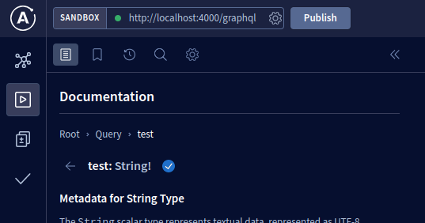

# Backend Dev Studies

## Setting prettier and eslint on vscode (optional)

Install the prettier extension for vscode

And add these settings to settings.json (you can remove it later)

```
"[typescript]": {
  "editor.defaultFormatter": "esbenp.prettier-vscode",
  "editor.formatOnPaste": true,
  "editor.formatOnSave": true,
},
```

## How to use the API

To access the "routes", use apollo studio at the [apollo playground](https://studio.apollographql.com/sandbox/explorer). 

Set up the API url on the studio at this field, on top left corner



> In order to access apollo studio and it's services, you have to create an account or log in.

Once the url is provided, the API documentation will already be imported alongside all the queries whose will be presented on `Documentation` section.